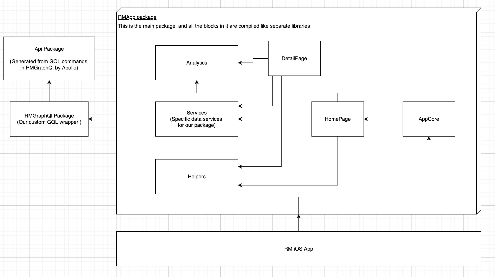

# RMApp - Scalability test
  Idea of this project is to test a couple of new technologies, and see how they scale and especially how they work together.
  Technologies used are [GraphQL](https://graphql.org), [Apollo](https://www.apollographql.com/docs/ios), SPM, SwiftUI.
  Api used: [Rick & Morty Api](https://rickandmortyapi.com)

 The component diagram can be seen in the image bellow:
 

## Component description

* **RMGraphQl Package**
    This is our main wrapper around the apollo client. It depends on the API package, but this is basically a fake package and it is generated by Apollo from this package based on the GraphQL queries that we define.

* **Services**
  This is just using the Repository pattern to abstract away the RMGraphQL package, and leave out RMApp package agnostic to that dependency. Also the idea is that we can plug in multiple APIs.

* **Analytics**
  Wrapper designed to handle usage of multiple analytics providers at the same time.

* **Pages (Home & Detail)**
  This pages are in separate packages to demonstrate how can we do **Vertical Splicing**, which is supper useful in a team that based around squads.
Both pages are using [The Composable Architecture](https://github.com/pointfreeco/swift-composable-architecture/) for state management.
  Here we have 3 levels of abstractions:
    * **Router** - core logic and state change management with the main state and action
    * **ViewState & ViewAction** - wrappers mapped to and from **Router State and Actions** adjusted to specific needs of the view that is using the core reducer
    * **View UIModel** - Model used in the view, and created from our ViewState, contains all the mappings and transformations we need to get the specific data used by our sub-views

    By following this approach we have maximal separation of concerns, and we simplify the *ViewBuilder* functions that our view has

* **AppCore**
  This package is mostly empty now because of the project size, but the idea of this package is to compose all the modules we have, in a specific way. If we would also want to support different platforms, and the core composition would not be the same, this would be the entry point for that.

## Testing and Development speed
### Dev testing
  This was one of the core concerns for this project.
  All of the package that we use in the project support MacOS, and the main reason for this so that the developers can run tests on their machine in parallel and not use the simulator. There is also a schema setup for the main package that is already has all the test that can be run on MacOS in it.

### Previews
  All the components injected in to the view have mocks that are injected when the views are used in the previews automatically, so development of views in previews is supper pleasant (until xcode goes crazy, and empty preview can not compile).

### CI Testing
  For this we have a specific schema (AllTests) that is gonna run all the tests from all the packages in sequence, embed everything in the main app, and run everything in the simulator.

### Snapshot testing
  I also tested **SnapShot** testing approach in this project. I have mixed felling about this. For testing of small reusable views in the app, they are great, also for testing of data structures that are quite big, but for testing of whole screens we are starting to run in the similar problems like when doing typical UI testing.

## Conclusion
  Development of this project was quite enjoyable and fast.
90% of it was done before i even connected and package to the host app, and actually run it in the simulator. Almost all of the development was done just by using test and previews. Also being able to run business logic test on the Mac was great. **GraphQl** is a amazing technology, and is super underrated. **Apollo** still has some problems that need some hacky workarounds, but i did not have any major problems with it. And on top of everything we get free cashing support for out app both in memory and in a **SQL lite** database.